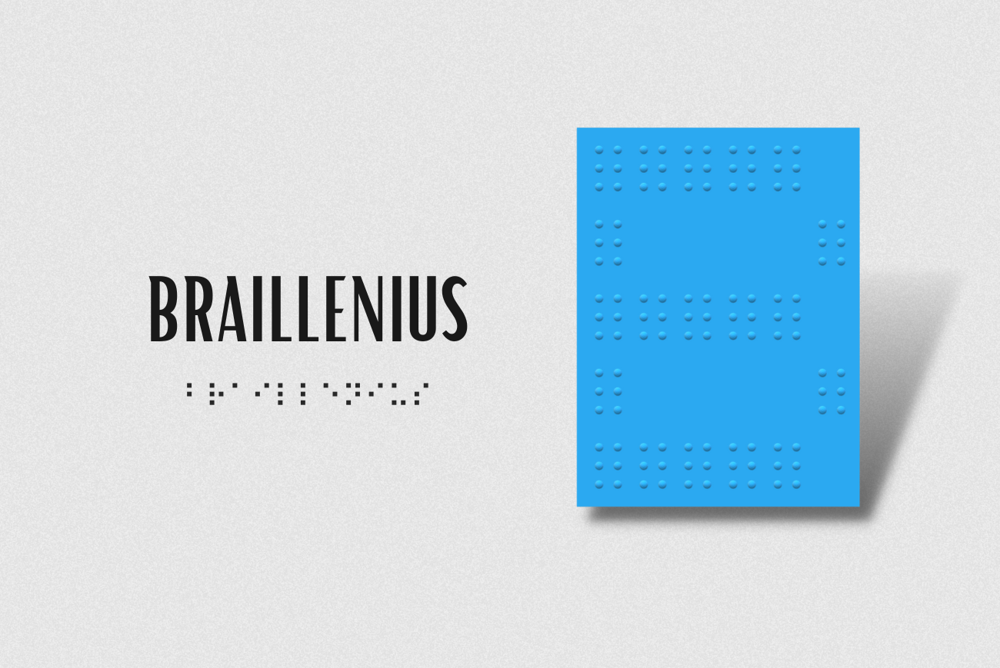

 

  <h1 align="center"><b>BRAILLENIUS</b></h1>

  

    Spreading awareness with Python and OpenScad.
     
    <a href="https://github.com/jungby/Braillenius/issues">Report bug or request a feature</a>
  

   

<!-- TABLE OF CONTENTS -->

  
Table of Contents

  <ol>
    <li>
      <a href="#about-the-project">About The Project</a>
    </li>
    <li>
      <a href="https://github.com/jungby/Braillenius/blob/master/INSTRUCTIONS.md")>Getting Started</a>
    </li>
    <li><a href="#future-changes-in-mind">Future changes</a></li>
    <li><a href="#contact-me">Contact</a></li>
  </ol>

---
## About the project

The main idea was just to translate, but after a while I decided that I might need to work on a better idea based on this one if I really want to spread awareness about how important accessibility is.

This is a braille translator 100% made with Python. Every version is different because I always try to improve and add more features to it, especially, after the df80bbc commit, I tried to reorganize the way this repo is going so had some big changes after that.

Please have in mind that Braillenius is made to translate from Spanish to Braille, English can be translated, but it won't be as precise as Spanish.

___Work in progress and has been only tested on Windows 10.___

---

## v1.0.0

* User-friendly interface (gui.py) and command line interface (ui.py)
* English and Spanish interface (only available on ui.py)
* Translates from Spanish to Braille and vice-versa
* Able to save your translation as .txt file
* Executable file for the GUI so there's no need to install anything

## v2.0.0

Previous features plus:

* Now supports 3D printing using OpenScad leaving a .stl file ready to be printed
* Minor changes on the interface but still only available in Spanish
* English added to the UI menu

---

## Future changes in mind

- [ ] Optimize convertion time from .scad to .stl
    - [ ] Add a loading bar
- [ ] Voice input
- [ ] Add an option to include the original text to the 3D model before the braille
- [x] Move executables to releases
- [ ] Multi-language Support
    - [x] English (only UI)
    - [x] Spanish
    - [ ] Portuguese
    - [ ] French

---

## Contact me
For now, the only social media I am willing to share are:
* Discord: jungby.exe
* Twitter: meowrasic
